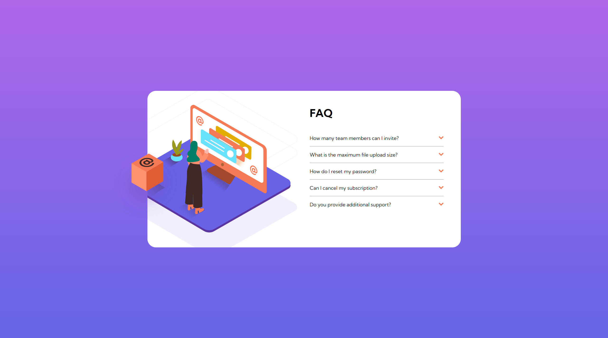

# Frontend Mentor - FAQ accordion card solution

This is a solution to the [FAQ accordion card challenge on Frontend Mentor](https://www.frontendmentor.io/challenges/faq-accordion-card-XlyjD0Oam). Frontend Mentor challenges help you improve your coding skills by building realistic projects.

## Table of contents

- [Overview](#overview)
  - [The challenge](#the-challenge)
  - [Screenshot](#screenshot)
  - [Links](#links)
- [My process](#my-process)
  - [Built with](#built-with)
  - [What I learned](#what-i-learned)
- [Author](#author)

## Overview

### The challenge

Users should be able to:

- View the optimal layout for the component depending on their device's screen size
- See hover states for all interactive elements on the page
- Hide/Show the answer to a question when the question is clicked

### Screenshot



### Links

- Solution URL: [https://github.com/KH-Ray/faq-accordian-card](https://github.com/KH-Ray/faq-accordian-card)
- Live Site URL: [https://kh-ray.github.io/faq-accordian-card/](https://kh-ray.github.io/faq-accordian-card/)

## My process

### Built with

- Semantic HTML5 markup
- Flexbox
- CSS Grid

### What I learned

Use this section to recap over some of your major learnings while working through this project. Writing these out and providing code samples of areas you want to highlight is a great way to reinforce your own knowledge.

To see how you can add code snippets, see below:

```html
<main class="main">
  <figure>
    
  </figure>

  <div class="faq grid grid--2-cols">
    <div class="left">
      
      
      
    </div>
    <div class="right">
      <h1 class="faq-title">FAQ</h1>

      <div class="overflow--auto">
        <div class="faq-questions">
          <div class="faq-question-answer">
            <div class="faq-question">
              How many team members can I invite?
              
            </div>
            <div class="faq-answers hidden">
              You can invite up to 2 additional users on the Free plan. There is
              no limit on team members for the Premium plan.
            </div>
          </div>
          <hr />
          <div class="faq-question-answer">
            <div class="faq-question">
              What is the maximum file upload size?
              
            </div>
            <div class="faq-answers hidden">
              No more than 2GB. All files in your account must fit your allotted
              storage space
            </div>
          </div>
          <hr />
          <div class="faq-question-answer">
            <div class="faq-question">
              How do I reset my password?
              
            </div>
            <div class="faq-answers hidden">
              Click “Forgot password” from the login page or “Change password”
              from your profile page. A reset link will be emailed to you.
            </div>
          </div>
          <hr />
          <div class="faq-question-answer">
            <div class="faq-question">
              Can I cancel my subscription?
              
            </div>
            <div class="faq-answers hidden">
              Yes! Send us a message and we’ll process your request no questions
              asked.
            </div>
          </div>
          <hr />
          <div class="faq-question-answer">
            <div class="faq-question">
              Do you provide additional support?
              
            </div>
            <div class="faq-answers hidden">
              Chat and email support is available 24/7. Phone lines are open
              during normal business hours.
            </div>
          </div>
        </div>
      </div>
    </div>
  </div>
</main>
```

```css
@media only screen and (max-width: 57em) {
  .faq {
    width: 95%;
  }
}

@media only screen and (max-width: 54em) {
  html {
    font-size: 57.5%;
  }

  .faq {
    padding: 1.6rem 0.8rem;
    grid-template-columns: 1fr;
    grid-template-rows: 1fr 1fr;
    row-gap: 4.8rem;
    justify-items: center;

    overflow: visible;
  }

  .left {
    margin-top: -25.6rem;
  }
  .right {
    width: 90%;
    margin-top: -41.5rem;
    margin-left: 0;
    transform: translateY(50%);
  }

  .faq-title {
    position: static;
    text-align: center;
    margin-bottom: 1.6rem;
  }

  .bg-pattern-desktop {
    top: -40%;
    left: 50%;
    transform: translate(-50%, 25%);
    height: 28rem;
    position: absolute;
  }

  .illustration-woman-online-desktop {
    display: none;
  }

  .illustration-woman-online-mobile {
    display: block;
    margin-bottom: 2.4rem;
    width: 28rem;
  }

  .illustration-box-desktop {
    display: none;
  }
}
  color: papayawhip;
}
```

```js
const proudOfThisFunc = () => {
const faqQuestionAnswer = document.querySelectorAll(".faq-question-answer");
const faqQuestion = document.querySelectorAll(".faq-question");

faqQuestionAnswer.forEach((text) => {
  text.addEventListener("click", () => {
    text.querySelector(".faq-question").classList.toggle("weight--700");
    text.querySelector(".icon-arrow").classList.toggle("rotate--180");
    text.querySelector(".faq-answers").classList.toggle("hidden");
  });
});

```

## Author

- Frontend Mentor - [@UncertainlySure](https://www.frontendmentor.io/profile/UncertainlySure)
